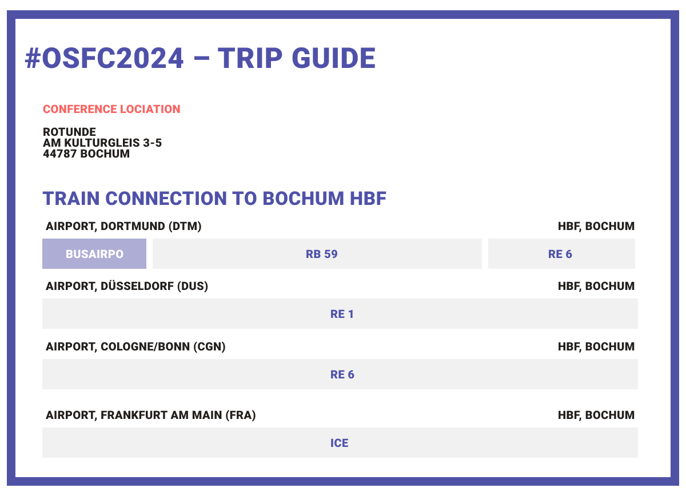
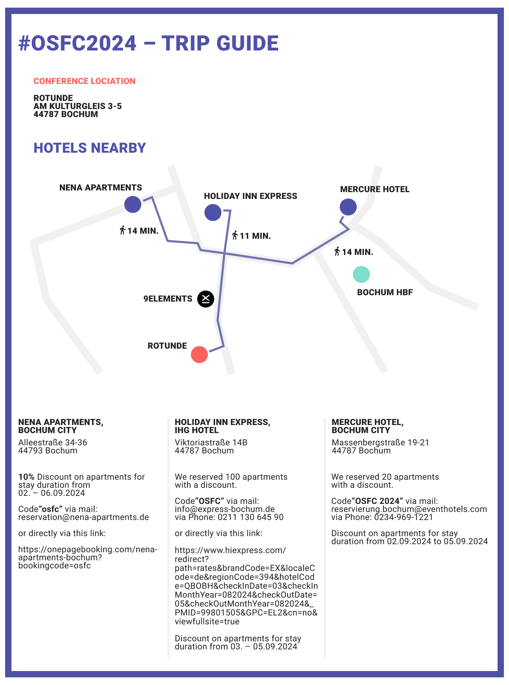

## Agenda (Overview) ##

For the detailed schedule check the [Schedule](https://www.osfc.io/2024/schedule/) page. You will find more information
about the social events under the [Social Event](#social-events) paragraph.

### Monday, September 2nd ###

Drink-up Event at the [Mandragora](https://maps.app.goo.gl/Kaswr3eiP6oNW4JZ8) in Bochum.

### Tuesday, September 3rd ###

- Open Gates at 8.30 am
- Talks start at 09.30 am
- Conference closes down at 10.00 pm

### Wednesday, September 4th ###
- Gates open at 8.30 am
- Talks start at 9.30 am
- Aftershow Party starts at 6.30 pm
- Gates close at 11.59pm

### Thursday, September 5th
- Gates open at 9.30 am
- Talks and Workshops start at 10.30 am
- Gates close at 04.00 pm

## #OSFC2024 – Trip Guide

Do you need help with planning your Stay? – We got you! Here we created a little #OSFC2024 Trip Guide for you!

### Airports nearby:

We recommend the Airport Dortmund (DTM), Airport Düsseldorf (DUS), Airport Köln Bonn (CGN) or Airport Frankfurt am Main (FRA) as Destination.

After you arrived safely at the Airport, the next stop is **Bochum City**! But be aware – _taking the train could be a little bit tricky sometimes_ (due to Delays or Strikes). But if you are brave enough, here are some trains you could take from each Airport:

Check out train connection yourself here: [https://int.bahn.de/en](https://int.bahn.de/en) or get the DB-App.
Alternatively, you can also get a **Taxi, Uber, Bolt** etc. that drives directly to your Hotel.

### Hotels nearby:

Here we have some Hotel recommendations for you. Each Hotel is not more than a **15 min** walk away from our Conference Location. And luckly we could gathered some special **OSFC-Discount** for you from each Hotel.

**Nena Apartments, Bochum City**

10% Discount on apartments for stay duration from 02. – 06.09.2024

Code ”osfc” via

- mail: reservation@nena-apartments.de or directly via this link: 
- or directly via this [link](https://onepagebooking.com/nena-apartments-bochum?bookingcode=osfc)

**Holiday Inn Express, IHG Hotel**
We reserved 100 apartments with a discount.

Code ”OSFC” via
- mail: [info@express-bochum.de](mailto:info@express-bochum.de)
- via Phone: +49 211 130 645 90
- or directly via this [link](https://www.ihg.com/holidayinnexpress/hotels/de/de/find-hotels/select-roomrate?fromRedirect=true&qSrt=sBR&qIta=99801505&icdv=99801505&qSlH=QBOBH&qCiD=03&qCiMy=082024&qCoD=05&qCoMy=082024&qGrpCd=EL2&setPMCookies=true&qSHBrC=EX&qDest=Viktoriastra%C3%9Fe%2014b,%20Bochum,%20DE&srb_u=1&qChAge=&qRmFltr=)

**Mercure Hotel, Bochum City**
We reserved 20 apartments with a discount.

Code ”OSFC 2024” via
- mail: [reservierung.bochum@eventhotels.com](mailto:reservierung.bochum@eventhotels.com)
- via Phone: +49 234 969 1221

Discount on apartments for stay duration from 02.09.2024 to 05.09.2024

## The Venue 

The OSFC 2024 will be hosted at the [Rotunde Venue, Bochum](https://maps.app.goo.gl/bavT7KUHg8rYSRRcA)

All the talks, sessions and workshops, as well as catering, will take place at the Rotunde Venue.

Find the conference schedule 2024 [here](https://www.osfc.io/2024/schedule/)

&nbsp;

## Social Events

We’ve got some fun "After Work" activities lined up for you guys!

**Monday, September 2nd - "Drink Up"** 

If you’re already in Bochum, come hang out with us at our local bar. It’s the perfect chance to get to know each other and explore the "Bermuda3eck" together. Your first Drink is on us! Let us know if you’re coming by filling out this quick survey. [[here](https://docs.google.com/forms/d/1SNNtunrPB1iVE5Axw4wzMtktYKGQd0y589v8nKy2Cxw/viewform?edit_requested=true)]

**Wednesday, September 4th - "Aftershow Party"**

On the second day of the conference, after all talks are done we will have a party in the Venue - we will open up the gates
for external guests (invite-only) and share drinks together. You are invited to hang around, get yourself a drink, some food
and enjoy the company. Of course all rooms will stay open until ~midnight.

If you want to get any guest on the invite list, reach out to info (at) osfc.io.

&nbsp;

## Food & Drinks

There will be a small breakfast and lunch every day. Beverages and snacks are available throughout the day.

&nbsp;

## Registration

On the first day, we will scan your conference ticket and you'll get a badge. This Badge is mandatory to access the building during the conference days. Also, please bring your ID or passport.

&nbsp;

## OSFC Slack Channel

Do you want to stay updated about our conference? Feel free to join the osfc channel at the [Open Source Firmware Slack](https://osfw.slack.com/)!

Get an invitation [here](https://slack.osfw.dev/)

&nbsp;

## Workshops

Good news! OSFC 2024 is bringing back the workshops, and you’re invited to join for free! 
The only thing you need to do is reserve your spot in advance since space is limited. So, make sure to sign up quickly!

We’re still finalizing the workshop topics and schedule, but stay tuned – we’ll announce everything soon!

&nbsp;

## Open Mic Session

Hey spontaneous thinkers, we’ve got something exciting for you!

On September 5th, we’ve got some open slots just waiting to be filled with your brilliant ideas. Yes, you heard that right – it’s time for the Open-Mic session, and we want YOU to grab the mic and share your thoughts!

Open Mic Application is coming soon! So stay tuned!

&nbsp;

## Hackathon Room

Use the hackathon room to team up with the community and work on all the cool open-source firmware projects.

You can use Slack as mentioned above to coordinate.

## Hardware Table

We will be hosting our hardware table again this year. If you have hardware that you would like to give away for free to allow others to hack on it, please feel free to bring it and leave it on the table. The table will be located in the hackathon room.

As always, please only take from the table what you truly want or need, ensuring that others also have the opportunity to acquire some items.

## Awareness

As an attendee of the OSFC we all commit to our [Code of Conduct](./code-of-conduct.md).
If you feel uncomfortable at any time, contact us at info@osc.io or contact the team at the event.
