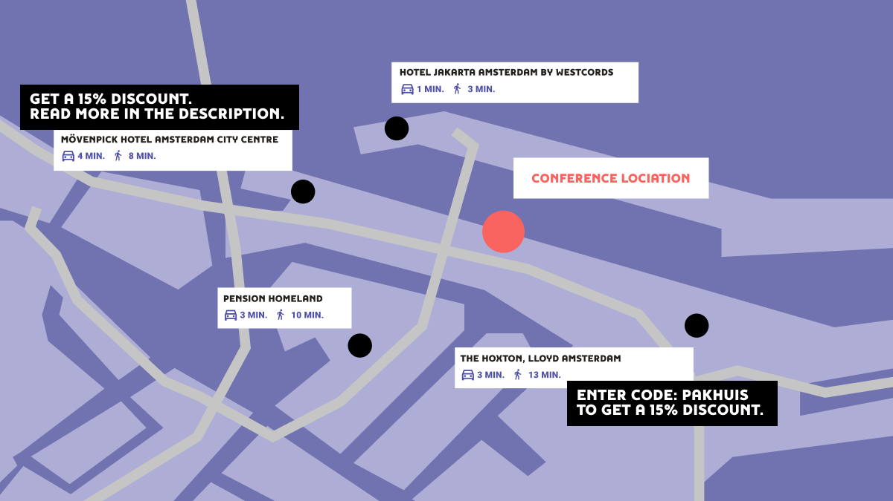

# **About OSFC**

The **Open Source Firmware Conference (OSFC)** is the leading event for open-source firmware, low-level engineering and platform security. Since 2018, OSFC has connected the global firmware community to exchange knowledge, share innovation and build lasting collaborations.

Our mission is simple:

**Connecting the people building the foundation of modern computing.**

OSFC brings together engineers, security researchers and technical leaders who share insights, real-world experience and ideas shaping the future of open firmware and open hardware.

## Who attends OSFC?

OSFC brings together professionals from across the firmware ecosystem, including engineers, platform architects, security researchers, silicon vendors and technical decision-makers.

## OSFC 2026 – the key facts

**Date:** September 15–17, 2026

**Location:** Amsterdam, The Netherlands

**Venue:** Pakhuis de Zwijger

**Tickets:** Early Bird sales have started – <a href="https://tickets.osfc.io" target="_blank">get your ticket now</a>

# **The Dates**

## Ticket Sales – <a href="https://tickets.osfc.io" target="_blank">Ticket Shop</a>

| Topic | Date |
| --- | --- |
| Early Bird Ticket Sales Start | April 13, 2026 |
| Early Bird Ticket Sales End | June 15, 2026 |
| Regular Ticket Sales | June 16 – September 15, 2026 |

## Call for Proposals (CfP) – <a href="https://talks.osfc.io" target="_blank">Submit here</a>

| Topic | Date |
| --- | --- |
| CfP Opens | April 13, 2026 |
| CfP Deadline | June 22, 2026 |

## Scholarship Program – <a href="https://bit.ly/OSFC26SCHOLARSHIP" target="_blank">Apply here</a>

| Topic | Date |
| --- | --- |
| Scholarship Applications Open | April 17, 2026 |
| Scholarship Application Deadline | July 1, 2026 |

## Conference Dates

| Topic | Date |
| --- | --- |
| OSFC 2026 | September 15–17, 2026 |

We may occasionally adjust timelines as the event approaches. All important updates will be communicated via:

- Our <a href="https://mailchi.mp/01a2d5ccbe95/osfc-subscription" target="_blank">newsletter</a>
- <a href="https://www.linkedin.com/company/open-source-firmware-conference/" target="_blank">LinkedIn</a>

We recommend <a href="https://mailchi.mp/01a2d5ccbe95/osfc-subscription" target="_blank">subscribing</a> to stay up to date on announcements, program updates and ticket availability.

# **Travel Information**

Amsterdam is easy to reach via international rail, Amsterdam Schiphol Airport (AMS) and European bus connections. The venue is well connected by public transport.

**Conference Location**

Pakhuis de Zwijger  
Piet Heinkade 179  
1019 HC Amsterdam  
Netherlands

**Conference Date**

September 15–17, 2026

# **Hotel Recommendations**

- **The Hoxton, Lloyd Amsterdam**  
Use the code **PAKHUIS** when booking directly through their site to get a 15% discount: <a href="https://thehoxton.com/amsterdam/lloyd/" target="_blank">https://thehoxton.com/amsterdam/lloyd/</a>  
Just a short walk from Pakhuis de Zwijger, The Hoxton Lloyd is your best bet for an easygoing base while in Amsterdam. Set in the former HQ of the Royal Lloyd Shipping Company, it's big on character, with bold design and all the Hox perks; think flexy check-in and check-out, free bikes to roam the city, and Hox Shop goodies to take a little piece home. If you feel like keeping the night going post-event, swing by Breman Brasserie for a delicious bite and a nightcap (or two).

- **Mövenpick Hotel Amsterdam City Centre**  
Get a 15% dynamic discount under this link: <a href="https://businesstravel.accor.com/en/booking/advanced-search.html?identification.reserverType=SC&identification.reserverId=SCP4230391&identification.reserverContract=EL241DE433" target="_blank">Book with discount</a>  
When searching for availability on the website, please select "Special Rates", then enter the Business client with contract under "Professional travellers" and the access code in the designated field.  
  - **Business client with contract**: SCP4230391
  - **Access code**: EL241DE433  

  Experience modern comfort, warm hospitality and breathtaking views of both the city skyline and the IJ river at Mövenpick Hotel Amsterdam City Centre. Ideally located in the heart of Amsterdam, the inviting 4-star hotel is within easy reach of everything the city has to offer.

- **Hotel Jakarta Amsterdam by WestCords**

- **Pension Homeland**

**Airport nearby:** Schiphol Amsterdam Airport  
**Train station nearby:** Amsterdam Centraal

# **Visa Support**

If you require a visa invitation letter, our crew is happy to support you. Just drop us a mail!

[info@osfc.io](mailto:info@osfc.io)

# **More than a conference**

OSFC is more than an event. It's a community of engineers building the open foundations of modern infrastructure.

**Join the people moving open firmware forward.**

We look forward to welcoming you to OSFC 2026 in Amsterdam.

– The OSFC Team
