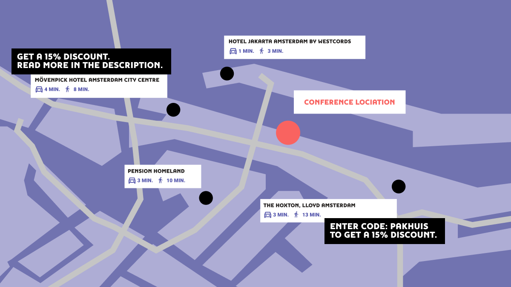

## About The Open Source Firmware Conference

The **Open Source Firmware Conference (OSFC)** is the leading event for open-source firmware, low-level engineering and platform security. Since 2018, OSFC has connected the global firmware community to exchange knowledge, share innovation and build lasting collaborations.
Our mission is simple:
**Connecting the people building the foundation of modern computing.**
OSFC brings together engineers, security researchers and technical leaders who share insights, real-world experience and ideas shaping the future of open firmware and open hardware.

**Who attends OSFC?**
OSFC brings together professionals from across the firmware ecosystem, including engineers, platform architects, security researchers, silicon vendors and technical decision-makers.

---

## OSFC 2026 – The Key Facts

- **📅 Date:** September 15–17, 2026
- **📍 Location:** Amsterdam, The Netherlands
- **🏛 Venue:** Pakhuis de Zwijger, Piet Heinkade 179 1019 HC Amsterdam Netherlands
- **🎟 Tickets:** [tickets.osfc.io](https://tickets.osfc.io/)
- **🎤 Schedule:** [https://talks.osfc.io/osfc-2026/schedule/](https://talks.osfc.io/osfc-2026/schedule/)

## 🎤 Open Mic

The mic is yours!
We've got a super cool opportunity for all you spontaneous thinkers out there.

So, on Thursday, September 17, the third day of the conference, we've got some open slots just waiting to be filled with your brilliant ideas. Yes, you heard that right - it's time for the Open-Mic session, and we want YOU to grab the mic and share your thoughts!

If we receive more proposals than we have slots, the attendees will vote for their favorites.

Submission-Deadline: **Day 2 (Wednesday, September 16), after lunch break**
[Submit your proposal](https://openmic.osfc.io/osfc26-open-mic/cfp)

## The Dates

### Call for Proposals (CfP)

_The submission deadline was July 1, 2026._

### Scholarship Program

_The application deadline was July 1, 2026._

### Conference Dates

OSFC 2026 will take place from September 15 to 17, 2026.

## OSFC 2026 - Social Events

### 1. OSFC – Pre-Event

**When?** 📅 September 14, 2026

OSFC Pre-Event 🍻 – Already in Amsterdam?

Many attendees arrive a day early after a long journey, so we thought: why not meet up before the conference officially starts?

Join us for a relaxed evening at a bar, grab a drink and get to know fellow attendees, speakers and us from the orga team before the first conference day begin.

We'll ask for a rough headcount a few weeks before OSFC so we can plan accordingly.

See you at the bar :)

### 2. OSFC – Social Event

**When?** 📅 September 16, 2026

OSFC Social Event 🚤 – “Open Source Firmware Conference .. but on a Boat”

We’re in Amsterdam!! A canal cruise was simply the obvious choice.

Join us for an evening cruise through Amsterdam's historic waterways together with fellow OSFC attendees. Let’s take in the full Amsterdam charm and continue the conversations in a slightly more scenic setting.

See you on board :)

---

## Stay Up To Date

We may occasionally adjust timelines as the event approaches. All important updates will be communicated via:

- [Our newsletter](https://mailchi.mp/01a2d5ccbe95/osfc-subscription)
- [LinkedIn](https://www.linkedin.com/company/osff)
- [The OSFC website](https://osfc.io/)

We recommend subscribing to stay up to date on announcements, program updates and ticket availability.

## Travel Information

Amsterdam is easy to reach via international rail, Amsterdam Schiphol Airport (AMS) and European bus connections. The venue is well connected by public transport.

### Hotel recommendations:

- #### The Hoxton, Lloyd Amsterdam

  **Use the code PAKHUIS when booking directly through our site to redeem the 15%** **discount:** [https://thehoxton.com/amsterdam/lloyd/](https://thehoxton.com/amsterdam/lloyd/)

  > **About the Hoxton lloyd:**
  > Just a short walk from Pakhuis de Zwijger, The Hoxton Lloyd is your best bet for an easygoing base while in Amsterdam. Set in the former HQ of the Royal Lloyd Shipping Company, it’s big on character, with bold design and all the Hox perks; think flexy check-in and check-out, free bikes to roam the city, and Hox Shop goodies to take a little piece home. If you feel like keeping the night going post-event, swing by Breman Brasserie for a delicious bite and a nightcap (or two).

- #### Mövenpick Hotel Amsterdam City Centre

  **Get a 15% dynamic discount with this link**:
  [**https://businesstravel.accor.com/en/booking/advanced-search.html?identification.reserverType=SC&identification.reserverId=SCP4230391&identification.reserverContract=EL241DE433**](https://businesstravel.accor.com/en/booking/advanced-search.html?identification.reserverType=SC&identification.reserverId=SCP4230391&identification.reserverContract=EL241DE433) 

  Through this link, you can directly make a reservation at Mövenpick Hotel Amsterdam City Centre with the discounted rate. There are two codes required to activate the rate:
  - Business client with contract: SCP4230391
  - Access code: EL241DE433
  When searching for availability on the website, please select “Special Rates”, then enter the Business client with contract under “Professional travellers” and the access code in the designated field.

  > **About Mövenpick Amsterdam City Centre:**
  > Experience modern comfort, warm hospitality and breathtaking views of both the city skyline and the IJ river at Mövenpick Hotel Amsterdam City Centre. Ideally located in the heart of Amsterdam, the inviting 4-star hotel is within easy reach of everything the city has to offer.

- #### Hotel Jakarta Amsterdam by WestCords

- #### Pension Homeland

---

### Airports close by

- Schiphol Amsterdam Airport

### Trainstation close by

- Amsterdam Centraal

---

## Visa Support

If you require a visa invitation letter, our crew is happy to support you. Just drop us a mail!

📩 [info@osfc.io](mailto:info@osfc.io)

## More Than A Conference

OSFC is more than an event. It’s a community of engineers building the open foundations of modern infrastructure.

**Join the people moving open firmware forward.**

## 🎟 Tickets:

<a href="https://tickets.osfc.io/" class="button">tickets.osfc.io</a>

---

We look forward to welcoming you to OSFC 2026 in Amsterdam.

– The OSFC Team
