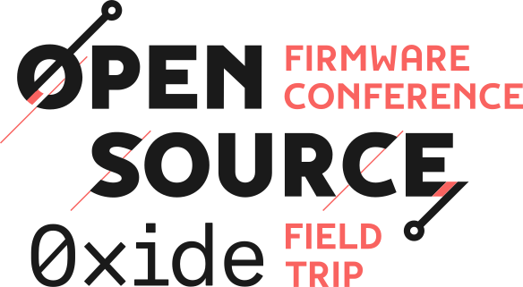

&nbsp;

&nbsp;

### Oxide 'Field Trip' After-Conference Party - OSFC 2023

We are excited to announce that our friends and long-term supporters, Oxide,
have generously invited all attendees of the Open-Source Firmware Conference
(OSFC) 2023 to their offices for an exclusive 'Day One - After-Conference Party'.
This event will originate in [Sunnyvale](https://goo.gl/maps/qyNkv7UffMGy5DKf9)
and take place in [Emeryville](https://goo.gl/maps/13akU4kV2jNS1cCV9)
on October 10th.

&nbsp;

### Schedule

- 4:30 PM: Departure from OSFC venue. We have arranged buses for the transit,
  please be on time as we aim to keep the schedule.
- 5:30 PM - 6:00 PM: Estimated arrival at [Oxide offices](https://goo.gl/maps/13akU4kV2jNS1cCV9).
  Expect an hour-long drive filled with conversation and anticipation. Do we have
  any volunteers for a spontaneous talk during the bus transfer [info@osfc.io](mailto:info@osfc.io)
- 6:00 PM onwards: Party begins! Explore Oxide's new hardware, mingle, and enjoy
  the evening with food and drinks.
- 9.00 PM - 9.30 PM: The bus will take you back to the venue. We will have an early
  bus leaving at 9.00 PM and a late bus leaving at 9.30 PM. Expect to be at the venue
  again between 10.00 PM and 10.30 PM.

&nbsp;

### Food & Drinks

Catering will be provided, and a variety of food options will be available to
cater to different dietary requirements. If you have any specific dietary needs,
please make sure to add this information when purchasing your conference ticket.
 

### Registration

The field trip is included at no additional cost with the purchase of your
OSFC conference ticket, however we need to know in advance how many of our attendees
will be joining us for the party. This will help us in making the necessary
arrangements and ensuring a smooth and enjoyable experience for everyone. We have a limit of 100 attendees for the field trip - first come, first served.

Please book a ticket with no additional costs for the Oxide Field Trip when purchasing
your OSFC conference ticket. If you have already purchased your ticket - drop us
an e-mail at [info@osfc.io](mailto:info@osfc.io).
